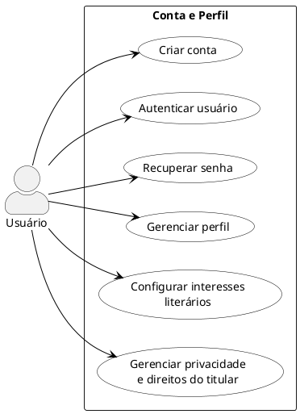
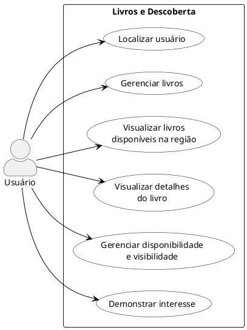
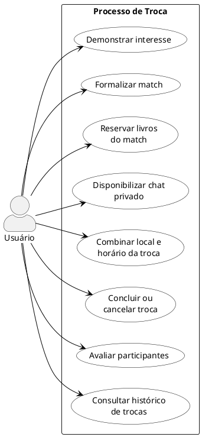
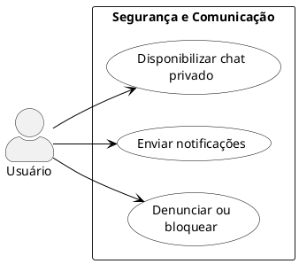
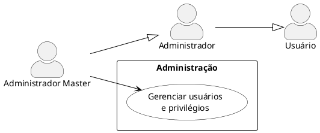
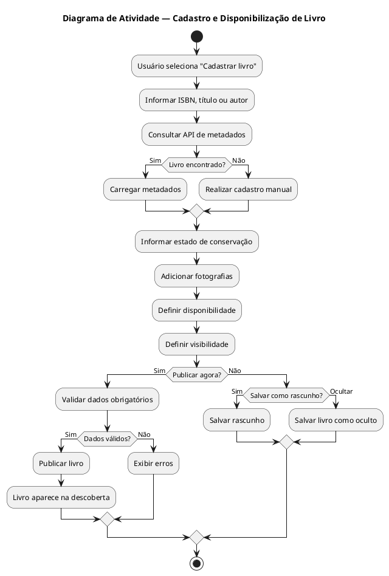
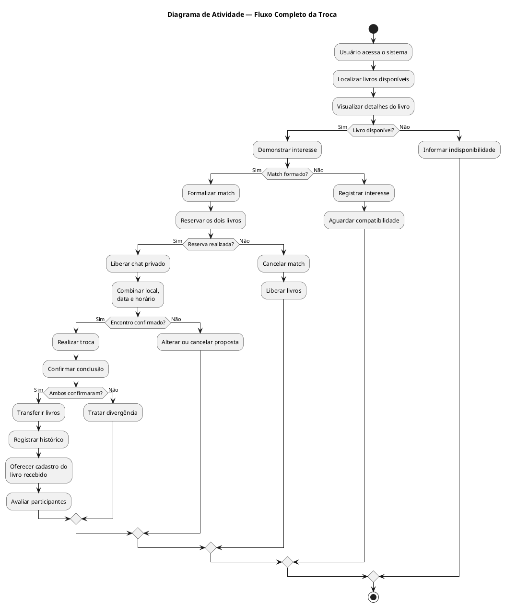
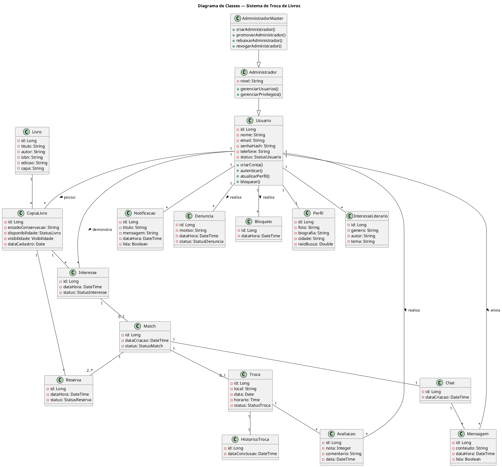

# 📚 Sistema de Troca de Livros — Diagramas UML

> Documentação dos diagramas UML do **Sistema de Troca de Livros**, desenvolvidos em **PlantUML**.

Este documento centraliza os códigos dos diagramas utilizados na modelagem do sistema, facilitando a consulta, manutenção, versionamento e apresentação no GitHub.

---

## 📑 Índice

### Casos de Uso
1. [Visão Geral](#1--visão-geral)
2. [Conta e Perfil](#2--conta-e-perfil)
3. [Livros e Descoberta](#3--livros-e-descoberta)
4. [Processo de Troca](#4--processo-de-troca)
5. [Segurança e Comunicação](#5--segurança-e-comunicação)
6. [Administração](#6--administração)

### Outros Diagramas
7. [Diagrama de Sequência](#7--diagrama-de-sequência)
8. [Atividade — Cadastro e Disponibilização de Livro](#8--atividade--cadastro-e-disponibilização-de-livro)
9. [Atividade — Processo Completo da Troca](#9--atividade--processo-completo-da-troca)
10. [Diagrama de Classes](#10--diagrama-de-classes)

### Organização
- [Estrutura dos arquivos](#-estrutura-dos-arquivos)
- [Como utilizar os códigos](#-como-utilizar-os-códigos)
- [Critério de organização](#-critério-de-organização)

---

## 🧭 Visão geral

| Nº | Diagrama | Finalidade |
|---|---|---|
| 1 | Casos de Uso — Visão Geral | Apresentar os principais módulos e atores |
| 2 | Casos de Uso — Conta e Perfil | Representar as funcionalidades de conta e perfil |
| 3 | Casos de Uso — Livros e Descoberta | Representar gerenciamento e descoberta de livros |
| 4 | Casos de Uso — Processo de Troca | Representar as funcionalidades da troca |
| 5 | Casos de Uso — Segurança e Comunicação | Representar comunicação e segurança |
| 6 | Casos de Uso — Administração | Representar as funções administrativas |
| 7 | Sequência Geral | Representar a ordem das interações do fluxo principal |
| 8 | Atividade — Cadastro de Livro | Representar o processo de cadastro e disponibilização |
| 9 | Atividade — Processo de Troca | Representar o fluxo completo de realização da troca |
| 10 | Classes | Representar entidades, atributos e relacionamentos |

---

# 1 — Visão Geral

Diagrama de casos de uso que apresenta uma visão resumida dos principais módulos do sistema e dos atores envolvidos.

```plantuml
@startuml
left to right direction

skinparam packageStyle rectangle
skinparam actorStyle awesome

actor "Usuário" as Usuario
actor "Administrador" as Admin
actor "Administrador Master" as Master

Admin --|> Usuario
Master --|> Admin

rectangle "Sistema de Troca de Livros" {

    package "Conta e Perfil" {
        usecase "Gerenciar conta\ne perfil" as Conta
    }

    package "Livros e Descoberta" {
        usecase "Gerenciar e descobrir\nlivros" as Livros
    }

    package "Troca" {
        usecase "Realizar troca\nde livros" as Troca
    }

    package "Segurança e Comunicação" {
        usecase "Comunicar e\nproteger usuários" as Seguranca
    }

    package "Administração" {
        usecase "Gerenciar usuários\ne privilégios" as AdminUC
    }
}

Usuario --> Conta
Usuario --> Livros
Usuario --> Troca
Usuario --> Seguranca

Master --> AdminUC

@enduml
```

[⬆ Voltar ao índice](#-índice)

---

# 2 — Conta e Perfil

Representa as funcionalidades relacionadas à criação, autenticação e gerenciamento da conta e do perfil do usuário.



[⬆ Voltar ao índice](#-índice)

---

# 3 — Livros e Descoberta

Representa o gerenciamento dos livros e as funcionalidades de descoberta e demonstração de interesse.



[⬆ Voltar ao índice](#-índice)

---

# 4 — Processo de Troca

Representa as funcionalidades envolvidas no processo de troca, desde o interesse até o histórico.



[⬆ Voltar ao índice](#-índice)

---

# 5 — Segurança e Comunicação

Representa os recursos de comunicação, notificações, denúncias e bloqueios.



[⬆ Voltar ao índice](#-índice)

---

# 6 — Administração

Representa as funcionalidades relacionadas ao gerenciamento de usuários e privilégios administrativos.



[⬆ Voltar ao índice](#-índice)

---

# 7 — Diagrama de Sequência

O diagrama de sequência apresenta o **fluxo temporal principal do sistema**, mostrando a interação entre usuário, aplicação, serviços e banco de dados.

### Fluxo principal

**Autenticação → Descoberta → Interesse → Match → Reserva → Chat → Combinação → Conclusão → Avaliação → Histórico**

```plantuml
@startuml
title Diagrama de Sequência Geral — Sistema de Troca de Livros

actor "Usuário" as Usuario

participant "Aplicativo Web" as App
participant "API / Sistema" as Sistema
participant "Serviço de Autenticação" as Auth
participant "Serviço de Livros" as Livros
participant "Serviço de Match" as Match
participant "Serviço de Troca" as Troca
participant "Serviço de Notificações" as Notif
database "Banco de Dados" as BD

== 1. Cadastro / Autenticação ==

Usuario -> App : Acessa o sistema
App -> Sistema : Solicita autenticação
Sistema -> Auth : Validar credenciais
Auth -> BD : Consultar usuário
BD --> Auth : Dados do usuário
Auth --> Sistema : Autenticação aprovada
Sistema --> App : Sessão iniciada
App --> Usuario : Exibe página inicial

== 2. Descoberta de livros ==

Usuario -> App : Busca livros disponíveis
App -> Sistema : Solicita livros da região
Sistema -> Livros : Buscar livros
Livros -> BD : Consultar livros disponíveis
BD --> Livros : Lista de livros
Livros --> Sistema : Livros encontrados
Sistema --> App : Retorna resultados
App --> Usuario : Exibe livros disponíveis

Usuario -> App : Visualiza detalhes do livro
App -> Sistema : Solicita detalhes
Sistema -> Livros : Consultar livro
Livros -> BD : Buscar informações
BD --> Livros : Dados do livro
Livros --> Sistema : Detalhes
Sistema --> App : Retorna detalhes
App --> Usuario : Exibe detalhes

== 3. Interesse e Match ==

Usuario -> App : Demonstra interesse
App -> Sistema : Registra interesse
Sistema -> Match : Analisar interesse
Match -> BD : Consultar compatibilidade
BD --> Match : Dados dos usuários/livros

alt Match não encontrado

    Match --> Sistema : Interesse registrado
    Sistema -> Notif : Gerar notificação
    Notif --> Usuario : Interesse registrado

else Match encontrado

    Match --> Sistema : Match confirmado

    Sistema -> Troca : Solicitar reserva
    Troca -> BD : Reservar livros

    alt Reserva realizada

        BD --> Troca : Reserva confirmada
        Troca --> Sistema : Match ativo

        Sistema -> Notif : Notificar participantes
        Notif --> Usuario : Match confirmado

    else Falha na reserva

        BD --> Troca : Reserva não realizada
        Troca --> Sistema : Operação cancelada
        Sistema --> App : Informa falha
        App --> Usuario : Reserva não realizada

    end

end

== 4. Chat e negociação ==

Usuario -> App : Abre chat do match
App -> Sistema : Solicita chat
Sistema -> BD : Validar match ativo
BD --> Sistema : Match válido
Sistema --> App : Libera chat

Usuario -> App : Envia mensagem
App -> Sistema : Envia mensagem
Sistema -> BD : Salva mensagem
Sistema -> Notif : Gerar notificação
Notif --> Usuario : Nova mensagem

== 5. Combinação da troca ==

Usuario -> App : Propõe local e horário
App -> Sistema : Envia proposta
Sistema -> Troca : Registrar proposta
Troca -> BD : Salvar local/data/horário
Sistema -> Notif : Notificar participante
Notif --> Usuario : Nova proposta recebida

Usuario -> App : Confirma proposta
App -> Sistema : Confirmar encontro
Sistema -> Troca : Atualizar troca
Troca -> BD : Salvar confirmação

== 6. Conclusão da troca ==

Usuario -> App : Confirma realização da troca
App -> Sistema : Solicita conclusão
Sistema -> Troca : Validar conclusão
Troca -> BD : Registrar conclusão

alt Troca concluída

    BD --> Troca : Operação concluída
    Troca --> Sistema : Troca finalizada

    Sistema -> BD : Registrar histórico
    Sistema -> Notif : Enviar confirmação
    Notif --> Usuario : Troca concluída

else Divergência

    BD --> Troca : Divergência identificada
    Troca --> Sistema : Solicitar tratamento
    Sistema --> App : Exibir divergência
    App --> Usuario : Orientação sobre divergência

end

== 7. Avaliação ==

Usuario -> App : Avalia participante
App -> Sistema : Envia avaliação
Sistema -> BD : Registrar avaliação
BD --> Sistema : Avaliação registrada
Sistema --> App : Confirma avaliação
App --> Usuario : Avaliação concluída

== 8. Histórico ==

Usuario -> App : Consulta histórico
App -> Sistema : Solicita histórico
Sistema -> BD : Buscar trocas concluídas
BD --> Sistema : Histórico
Sistema --> App : Retorna histórico
App --> Usuario : Exibe histórico

@enduml
```



[⬆ Voltar ao índice](#-índice)

---

# 8 — Atividade — Cadastro e Disponibilização de Livro

Este diagrama representa o processo de cadastro e disponibilização de um livro.

A separação desse fluxo permite representar com maior clareza as decisões relacionadas à consulta de metadados, cadastro manual, disponibilidade, visibilidade e publicação.



[⬆ Voltar ao índice](#-índice)

---

# 9 — Atividade — Processo Completo da Troca

Este diagrama representa o processo principal de negócio da plataforma, desde a demonstração de interesse até a conclusão e avaliação da troca.

Os dois diagramas de atividade são mantidos separados porque representam **processos de negócio distintos**. Dessa forma, evita-se um fluxo excessivamente grande e melhora-se a legibilidade do modelo.



[⬆ Voltar ao índice](#-índice)

---

# 10 — Diagrama de Classes

O diagrama de classes apresenta o modelo conceitual do sistema, incluindo as principais entidades, atributos e relacionamentos.



[⬆ Voltar ao índice](#-índice)

---

# 📁 Estrutura dos arquivos

Uma organização recomendada para o repositório é:

```text
diagramas/
│
├── README.md
│
├── casos-de-uso/
│   ├── 01-visao-geral.puml
│   ├── 02-conta-perfil.puml
│   ├── 03-livros-descoberta.puml
│   ├── 04-processo-troca.puml
│   ├── 05-seguranca-comunicacao.puml
│   └── 06-administracao.puml
│
├── sequencia/
│   └── 01-sequencia-geral.puml
│
├── atividades/
│   ├── 01-cadastro-livro.puml
│   └── 02-processo-troca.puml
│
└── classes/
    └── 01-modelo-geral.puml
```

---

# 🛠️ Como utilizar os códigos

Cada bloco `plantuml` pode ser copiado diretamente para um arquivo com extensão `.puml`.

### Exemplo

Crie:

```text
01-sequencia-geral.puml
```

e coloque dentro dele o código correspondente ao **Diagrama de Sequência Geral**.

Depois, o arquivo pode ser aberto em uma ferramenta compatível com PlantUML para gerar a representação gráfica.

### No Visual Studio Code

Uma forma prática de trabalhar é utilizar uma extensão de PlantUML para:

- editar os arquivos `.puml`;
- visualizar o diagrama;
- corrigir erros de sintaxe;
- gerar as imagens dos diagramas.

### No GitHub

O ideal é manter os **arquivos `.puml` como fonte dos diagramas** e, caso seja necessário apresentar as imagens diretamente no README, gerar também versões `.png` ou `.svg`.

Uma estrutura possível:

```text
diagramas/
├── casos-de-uso/
│   ├── codigo/
│   └── imagens/
│
├── sequencia/
│   ├── codigo/
│   └── imagens/
│
├── atividades/
│   ├── codigo/
│   └── imagens/
│
└── classes/
    ├── codigo/
    └── imagens/
```

---

# 📝 Critério de organização

Os diagramas foram separados de acordo com a finalidade de cada representação UML:

### Casos de Uso

Mostram **o que o sistema oferece** e **quem interage com cada funcionalidade**.

### Diagrama de Sequência

Mostra **como as partes do sistema interagem ao longo do tempo** durante o fluxo principal.

### Diagramas de Atividade

Mostram **como os processos são executados**, incluindo ações, decisões e caminhos alternativos.

Foram utilizados dois diagramas de atividade porque existem dois processos principais com objetivos diferentes:

1. **Cadastro e disponibilização de livro**
2. **Processo de realização da troca**

Separá-los evita que um único diagrama fique excessivamente complexo.

### Diagrama de Classes

Mostra **a estrutura estática do sistema**, suas principais entidades, atributos e relacionamentos.

---

# 📌 Observações

- Os códigos PlantUML deste documento devem ser considerados a **fonte dos diagramas**.
- Os arquivos `.puml` podem ser versionados normalmente pelo Git.
- As imagens podem ser geradas posteriormente a partir dos mesmos códigos.
- A separação dos diagramas tem como objetivo melhorar **organização, legibilidade e manutenção**.
- Os códigos dos diagramas foram mantidos **sem alterações**; apenas a documentação ao redor deles foi reorganizada para facilitar o uso.

---

## 👨‍💻 Projeto

**Sistema de Troca de Livros**

**Modelagem:** UML / PlantUML  
**Documentação:** Markdown  
**Versionamento:** Git / GitHub
