# 📚 Sistema de Troca de Livros — Diagramas UML

> Documentação dos diagramas do **Sistema de Troca de Livros**, contendo os códigos-fonte em **PlantUML e Mermaid**.

Este documento reúne os comandos utilizados na construção dos diagramas para que a modelagem possa ser consultada diretamente no código, além da representação visual gerada pelas ferramentas compatíveis.

---

## 📑 Índice

### Casos de Uso
1. [Visão Geral](#1--visão-geral)
2. [Conta e Perfil](#2--conta-e-perfil)
3. [Livros e Descoberta](#3--livros-e-descoberta)
4. [Processo de Troca](#4--processo-de-troca)
5. [Segurança e Comunicação](#5--segurança-e-comunicação)
6. [Administração](#6--administração)

### Outros Diagramas
7. [Diagrama de Sequência](#7--diagrama-de-sequência)
8. [Atividade — Cadastro e Disponibilização de Livro](#8--atividade--cadastro-e-disponibilização-de-livro)
9. [Atividade — Processo Completo da Troca](#9--atividade--processo-completo-da-troca)
10. [Diagrama de Classes](#10--diagrama-de-classes)

---

## 🧭 Visão geral

| Nº | Diagrama | Representação |
|---|---|---|
| 1 | Casos de Uso — Visão Geral | PlantUML + Mermaid |
| 2 | Casos de Uso — Conta e Perfil | PlantUML + Mermaid |
| 3 | Casos de Uso — Livros e Descoberta | PlantUML + Mermaid |
| 4 | Casos de Uso — Processo de Troca | PlantUML + Mermaid |
| 5 | Casos de Uso — Segurança e Comunicação | PlantUML + Mermaid |
| 6 | Casos de Uso — Administração | PlantUML + Mermaid |
| 7 | Diagrama de Sequência | PlantUML + Mermaid |
| 8 | Diagrama de Atividade — Cadastro de Livro | PlantUML + Mermaid |
| 9 | Diagrama de Atividade — Processo de Troca | PlantUML + Mermaid |
| 10 | Diagrama de Classes | PlantUML + Mermaid |

---

# 1 — Visão Geral

Apresenta uma visão resumida dos principais módulos do sistema e dos atores envolvidos.

## Código PlantUML

```plantuml
@startuml
left to right direction

skinparam packageStyle rectangle
skinparam actorStyle awesome

actor "Usuário" as Usuario
actor "Administrador" as Admin
actor "Administrador Master" as Master

Admin --|> Usuario
Master --|> Admin

rectangle "Sistema de Troca de Livros" {

    package "Conta e Perfil" {
        usecase "Gerenciar conta\ne perfil" as Conta
    }

    package "Livros e Descoberta" {
        usecase "Gerenciar e descobrir\nlivros" as Livros
    }

    package "Troca" {
        usecase "Realizar troca\nde livros" as Troca
    }

    package "Segurança e Comunicação" {
        usecase "Comunicar e\nproteger usuários" as Seguranca
    }

    package "Administração" {
        usecase "Gerenciar usuários\ne privilégios" as AdminUC
    }
}

Usuario --> Conta
Usuario --> Livros
Usuario --> Troca
Usuario --> Seguranca

Master --> AdminUC

@enduml
```

## Código Mermaid

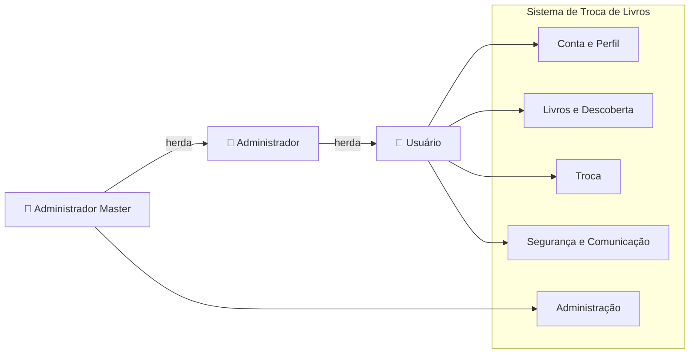

[⬆ Voltar ao índice](#-índice)

---

# 2 — Conta e Perfil

Representa as funcionalidades relacionadas à criação, autenticação e gerenciamento da conta e do perfil.

## Código PlantUML

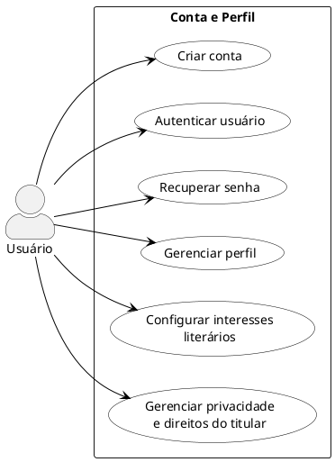

## Código Mermaid

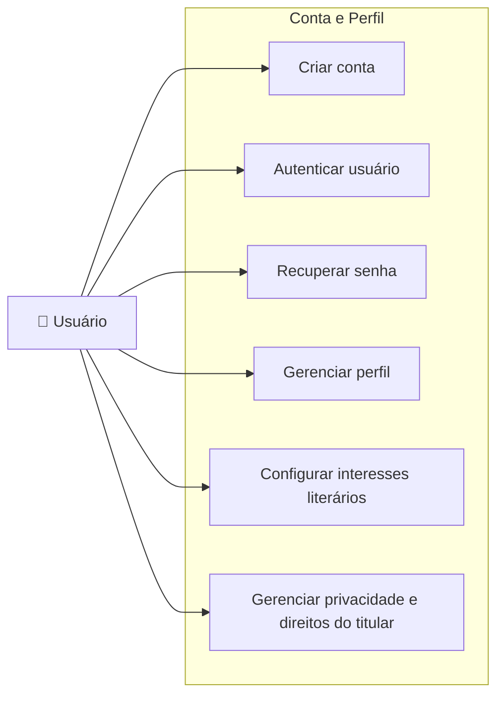

[⬆ Voltar ao índice](#-índice)

---

# 3 — Livros e Descoberta

Representa o gerenciamento dos livros e as funcionalidades de descoberta e demonstração de interesse.

## Código PlantUML

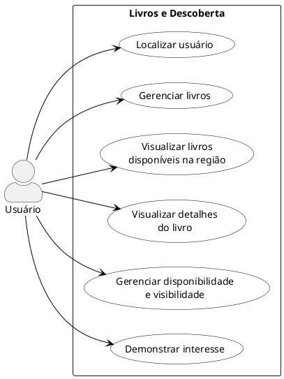

## Código Mermaid

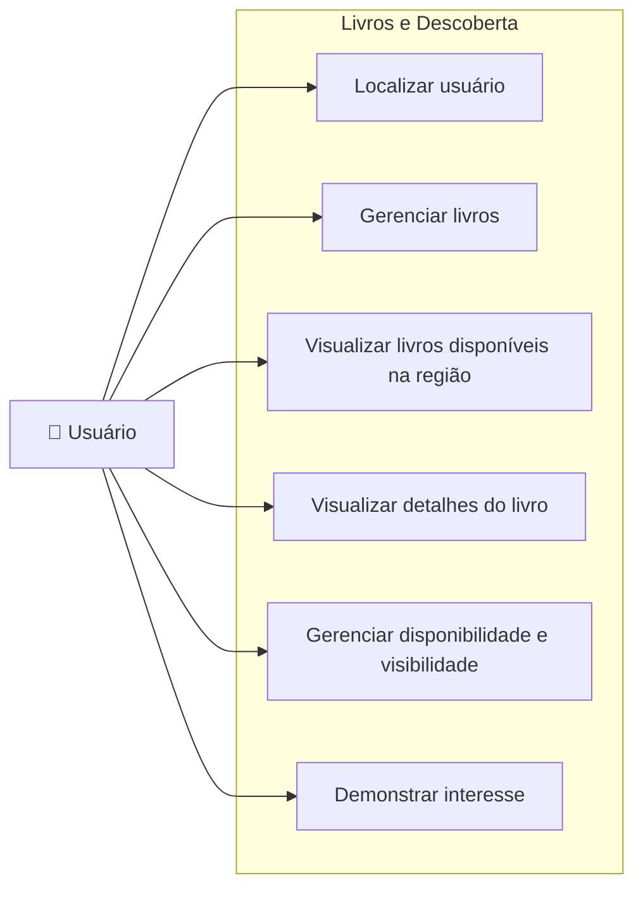

[⬆ Voltar ao índice](#-índice)

---

# 4 — Processo de Troca

Representa as funcionalidades envolvidas no processo de troca, desde o interesse até o histórico.

## Código PlantUML

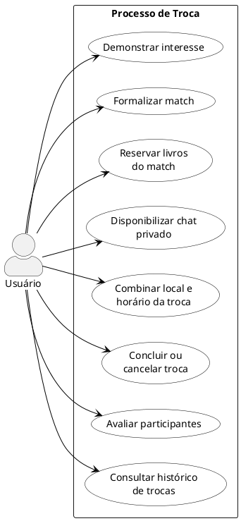

## Código Mermaid

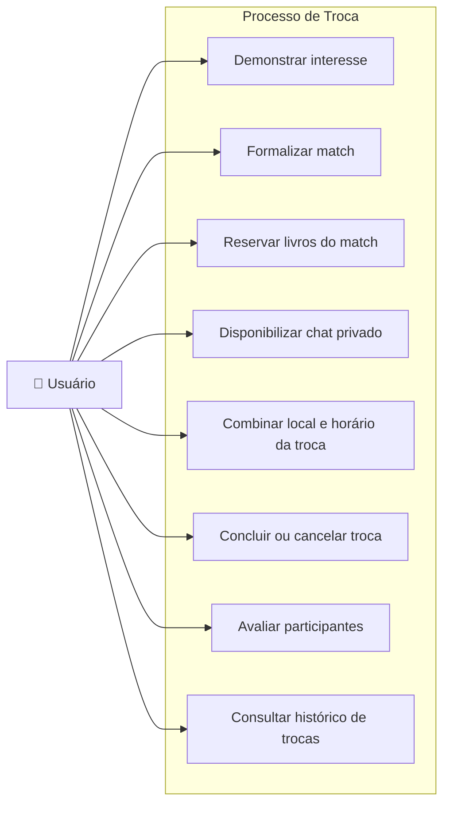

[⬆ Voltar ao índice](#-índice)

---

# 5 — Segurança e Comunicação

Representa os recursos de comunicação, notificações, denúncias e bloqueios.

## Código PlantUML

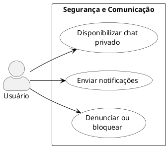

## Código Mermaid

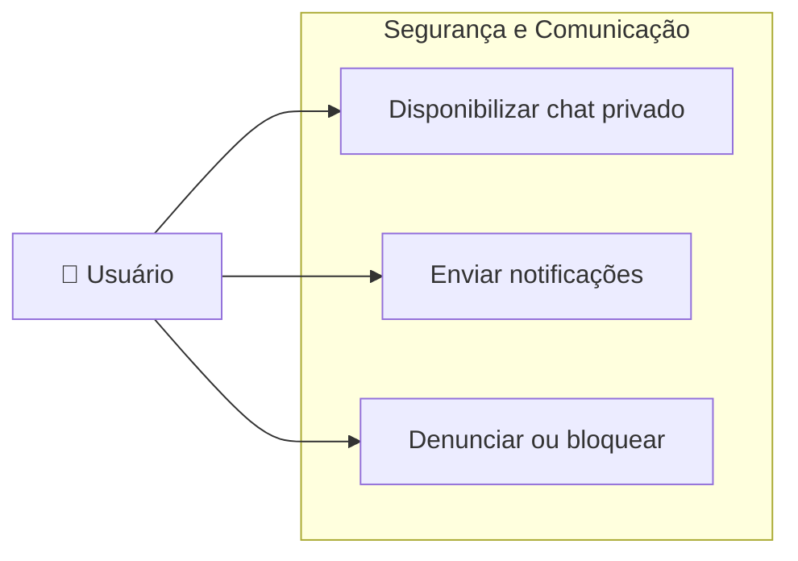

[⬆ Voltar ao índice](#-índice)

---

# 6 — Administração

Representa as funcionalidades relacionadas ao gerenciamento de usuários e privilégios administrativos.

## Código PlantUML

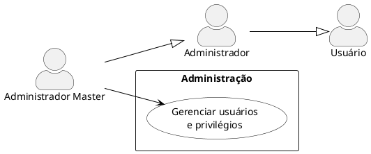

## Código Mermaid

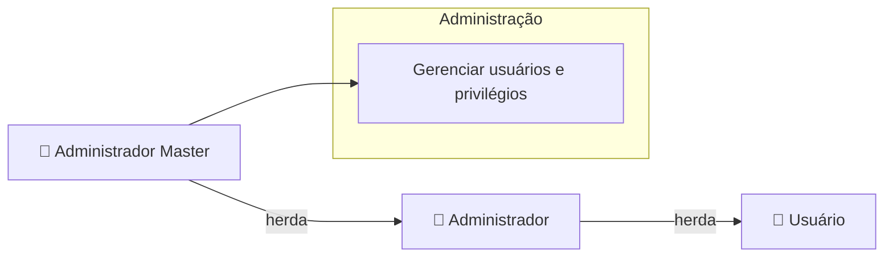

[⬆ Voltar ao índice](#-índice)

---

# 7 — Sequência Geral

Apresenta o fluxo temporal principal, mostrando as interações entre usuário, aplicação, serviços e banco de dados.

## Código PlantUML

```plantuml
@startuml
title Diagrama de Sequência Geral — Sistema de Troca de Livros

actor "Usuário" as Usuario

participant "Aplicativo Web" as App
participant "API / Sistema" as Sistema
participant "Serviço de Autenticação" as Auth
participant "Serviço de Livros" as Livros
participant "Serviço de Match" as Match
participant "Serviço de Troca" as Troca
participant "Serviço de Notificações" as Notif
database "Banco de Dados" as BD

== 1. Cadastro / Autenticação ==

Usuario -> App : Acessa o sistema
App -> Sistema : Solicita autenticação
Sistema -> Auth : Validar credenciais
Auth -> BD : Consultar usuário
BD --> Auth : Dados do usuário
Auth --> Sistema : Autenticação aprovada
Sistema --> App : Sessão iniciada
App --> Usuario : Exibe página inicial

== 2. Descoberta de livros ==

Usuario -> App : Busca livros disponíveis
App -> Sistema : Solicita livros da região
Sistema -> Livros : Buscar livros
Livros -> BD : Consultar livros disponíveis
BD --> Livros : Lista de livros
Livros --> Sistema : Livros encontrados
Sistema --> App : Retorna resultados
App --> Usuario : Exibe livros disponíveis

Usuario -> App : Visualiza detalhes do livro
App -> Sistema : Solicita detalhes
Sistema -> Livros : Consultar livro
Livros -> BD : Buscar informações
BD --> Livros : Dados do livro
Livros --> Sistema : Detalhes
Sistema --> App : Retorna detalhes
App --> Usuario : Exibe detalhes

== 3. Interesse e Match ==

Usuario -> App : Demonstra interesse
App -> Sistema : Registra interesse
Sistema -> Match : Analisar interesse
Match -> BD : Consultar compatibilidade
BD --> Match : Dados dos usuários/livros

alt Match não encontrado

    Match --> Sistema : Interesse registrado
    Sistema -> Notif : Gerar notificação
    Notif --> Usuario : Interesse registrado

else Match encontrado

    Match --> Sistema : Match confirmado

    Sistema -> Troca : Solicitar reserva
    Troca -> BD : Reservar livros

    alt Reserva realizada

        BD --> Troca : Reserva confirmada
        Troca --> Sistema : Match ativo

        Sistema -> Notif : Notificar participantes
        Notif --> Usuario : Match confirmado

    else Falha na reserva

        BD --> Troca : Reserva não realizada
        Troca --> Sistema : Operação cancelada
        Sistema --> App : Informa falha
        App --> Usuario : Reserva não realizada

    end

end

== 4. Chat e negociação ==

Usuario -> App : Abre chat do match
App -> Sistema : Solicita chat
Sistema -> BD : Validar match ativo
BD --> Sistema : Match válido
Sistema --> App : Libera chat

Usuario -> App : Envia mensagem
App -> Sistema : Envia mensagem
Sistema -> BD : Salva mensagem
Sistema -> Notif : Gerar notificação
Notif --> Usuario : Nova mensagem

== 5. Combinação da troca ==

Usuario -> App : Propõe local e horário
App -> Sistema : Envia proposta
Sistema -> Troca : Registrar proposta
Troca -> BD : Salvar local/data/horário
Sistema -> Notif : Notificar participante
Notif --> Usuario : Nova proposta recebida

Usuario -> App : Confirma proposta
App -> Sistema : Confirmar encontro
Sistema -> Troca : Atualizar troca
Troca -> BD : Salvar confirmação

== 6. Conclusão da troca ==

Usuario -> App : Confirma realização da troca
App -> Sistema : Solicita conclusão
Sistema -> Troca : Validar conclusão
Troca -> BD : Registrar conclusão

alt Troca concluída

    BD --> Troca : Operação concluída
    Troca --> Sistema : Troca finalizada

    Sistema -> BD : Registrar histórico
    Sistema -> Notif : Enviar confirmação
    Notif --> Usuario : Troca concluída

else Divergência

    BD --> Troca : Divergência identificada
    Troca --> Sistema : Solicitar tratamento
    Sistema --> App : Exibir divergência
    App --> Usuario : Orientação sobre divergência

end

== 7. Avaliação ==

Usuario -> App : Avalia participante
App -> Sistema : Envia avaliação
Sistema -> BD : Registrar avaliação
BD --> Sistema : Avaliação registrada
Sistema --> App : Confirma avaliação
App --> Usuario : Avaliação concluída

== 8. Histórico ==

Usuario -> App : Consulta histórico
App -> Sistema : Solicita histórico
Sistema -> BD : Buscar trocas concluídas
BD --> Sistema : Histórico
Sistema --> App : Retorna histórico
App --> Usuario : Exibe histórico

@enduml
```

## Código Mermaid

```mermaid
sequenceDiagram
    actor Usuario as Usuário
    participant App as Aplicativo Web
    participant Sistema as API / Sistema
    participant Auth as Serviço de Autenticação
    participant Livros as Serviço de Livros
    participant Match as Serviço de Match
    participant Troca as Serviço de Troca
    participant Notif as Serviço de Notificações
    participant BD as Banco de Dados

    Note over Usuario,BD: 1. Cadastro / Autenticação
    Usuario->>App: Acessa o sistema
    App->>Sistema: Solicita autenticação
    Sistema->>Auth: Validar credenciais
    Auth->>BD: Consultar usuário
    BD-->>Auth: Dados do usuário
    Auth-->>Sistema: Autenticação aprovada
    Sistema-->>App: Sessão iniciada
    App-->>Usuario: Exibe página inicial

    Note over Usuario,BD: 2. Descoberta de livros
    Usuario->>App: Busca livros disponíveis
    App->>Sistema: Solicita livros da região
    Sistema->>Livros: Buscar livros
    Livros->>BD: Consultar livros disponíveis
    BD-->>Livros: Lista de livros
    Livros-->>Sistema: Livros encontrados
    Sistema-->>App: Retorna resultados
    App-->>Usuario: Exibe livros disponíveis

    Usuario->>App: Visualiza detalhes do livro
    App->>Sistema: Solicita detalhes
    Sistema->>Livros: Consultar livro
    Livros->>BD: Buscar informações
    BD-->>Livros: Dados do livro
    Livros-->>Sistema: Detalhes
    Sistema-->>App: Retorna detalhes
    App-->>Usuario: Exibe detalhes

    Note over Usuario,BD: 3. Interesse e Match
    Usuario->>App: Demonstra interesse
    App->>Sistema: Registra interesse
    Sistema->>Match: Analisar interesse
    Match->>BD: Consultar compatibilidade
    BD-->>Match: Dados dos usuários/livros

    alt Match não encontrado
        Match-->>Sistema: Interesse registrado
        Sistema->>Notif: Gerar notificação
        Notif-->>Usuario: Interesse registrado
    else Match encontrado
        Match-->>Sistema: Match confirmado
        Sistema->>Troca: Solicitar reserva
        Troca->>BD: Reservar livros

        alt Reserva realizada
            BD-->>Troca: Reserva confirmada
            Troca-->>Sistema: Match ativo
            Sistema->>Notif: Notificar participantes
            Notif-->>Usuario: Match confirmado
        else Falha na reserva
            BD-->>Troca: Reserva não realizada
            Troca-->>Sistema: Operação cancelada
            Sistema-->>App: Informa falha
            App-->>Usuario: Reserva não realizada
        end
    end

    Note over Usuario,BD: 4. Chat e negociação
    Usuario->>App: Abre chat do match
    App->>Sistema: Solicita chat
    Sistema->>BD: Validar match ativo
    BD-->>Sistema: Match válido
    Sistema-->>App: Libera chat

    Usuario->>App: Envia mensagem
    App->>Sistema: Envia mensagem
    Sistema->>BD: Salva mensagem
    Sistema->>Notif: Gerar notificação
    Notif-->>Usuario: Nova mensagem

    Note over Usuario,BD: 5. Combinação da troca
    Usuario->>App: Propõe local e horário
    App->>Sistema: Envia proposta
    Sistema->>Troca: Registrar proposta
    Troca->>BD: Salvar local/data/horário
    Sistema->>Notif: Notificar participante
    Notif-->>Usuario: Nova proposta recebida

    Usuario->>App: Confirma proposta
    App->>Sistema: Confirmar encontro
    Sistema->>Troca: Atualizar troca
    Troca->>BD: Salvar confirmação

    Note over Usuario,BD: 6. Conclusão da troca
    Usuario->>App: Confirma realização da troca
    App->>Sistema: Solicita conclusão
    Sistema->>Troca: Validar conclusão
    Troca->>BD: Registrar conclusão

    alt Troca concluída
        BD-->>Troca: Operação concluída
        Troca-->>Sistema: Troca finalizada
        Sistema->>BD: Registrar histórico
        Sistema->>Notif: Enviar confirmação
        Notif-->>Usuario: Troca concluída
    else Divergência
        BD-->>Troca: Divergência identificada
        Troca-->>Sistema: Solicitar tratamento
        Sistema-->>App: Exibir divergência
        App-->>Usuario: Orientação sobre divergência
    end

    Note over Usuario,BD: 7. Avaliação
    Usuario->>App: Avalia participante
    App->>Sistema: Envia avaliação
    Sistema->>BD: Registrar avaliação
    BD-->>Sistema: Avaliação registrada
    Sistema-->>App: Confirma avaliação
    App-->>Usuario: Avaliação concluída

    Note over Usuario,BD: 8. Histórico
    Usuario->>App: Consulta histórico
    App->>Sistema: Solicita histórico
    Sistema->>BD: Buscar trocas concluídas
    BD-->>Sistema: Histórico
    Sistema-->>App: Retorna histórico
    App-->>Usuario: Exibe histórico

```

[⬆ Voltar ao índice](#-índice)

---

# 8 — Atividade — Cadastro e Disponibilização de Livro

Representa o processo de cadastro e disponibilização de um livro, incluindo suas decisões e caminhos alternativos.

## Código PlantUML

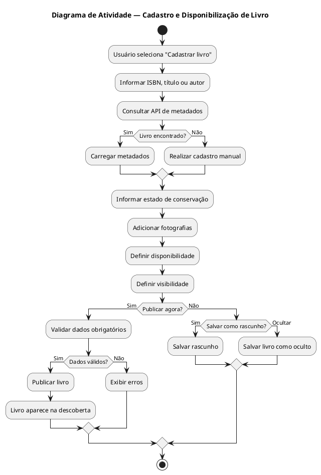

## Código Mermaid

```mermaid
flowchart TD
    A([Início]) --> B[Usuário seleciona "Cadastrar livro"]
    B --> C[Informar ISBN, título ou autor]
    C --> D[Consultar API de metadados]
    D --> E{Livro encontrado?}

    E -->|Sim| F[Carregar metadados]
    E -->|Não| G[Realizar cadastro manual]

    F --> H[Informar estado de conservação]
    G --> H
    H --> I[Adicionar fotografias]
    I --> J[Definir disponibilidade]
    J --> K[Definir visibilidade]
    K --> L{Publicar agora?}

    L -->|Sim| M[Validar dados obrigatórios]
    M --> N{Dados válidos?}
    N -->|Sim| O[Publicar livro]
    O --> P[Livro aparece na descoberta]
    N -->|Não| Q[Exibir erros]

    L -->|Não| R{Salvar como rascunho?}
    R -->|Sim| S[Salvar rascunho]
    R -->|Não| T[Salvar livro como oculto]

    P --> U([Fim])
    Q --> U
    S --> U
    T --> U

```

[⬆ Voltar ao índice](#-índice)

---

# 9 — Atividade — Processo Completo da Troca

Representa o processo principal de negócio, desde a demonstração de interesse até a conclusão e avaliação da troca.

## Código PlantUML

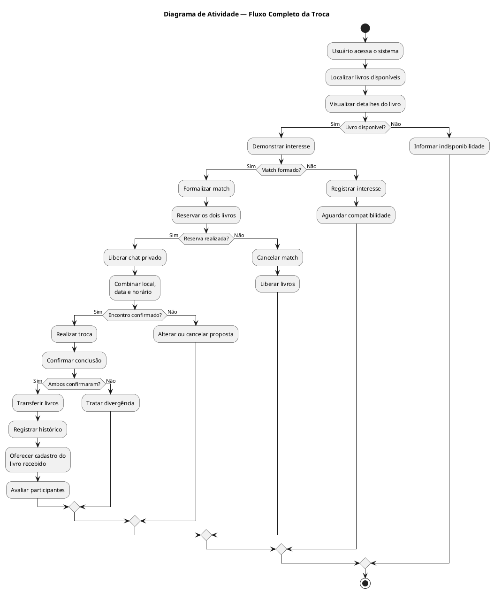

## Código Mermaid

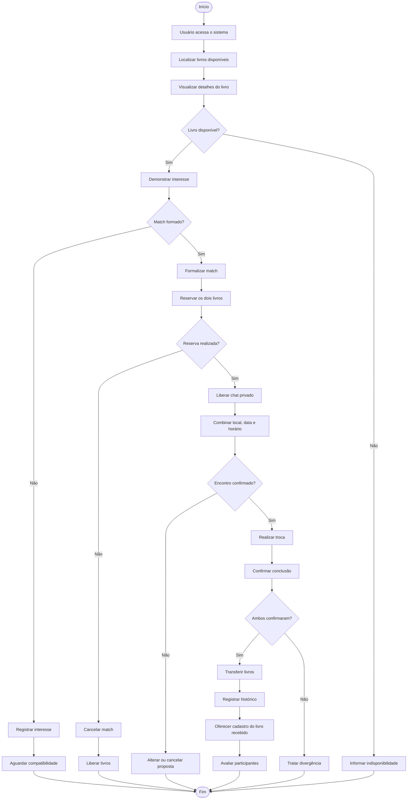

[⬆ Voltar ao índice](#-índice)

---

# 10 — Diagrama de Classes

Apresenta o modelo conceitual das principais entidades, atributos e relacionamentos do sistema.

## Código PlantUML

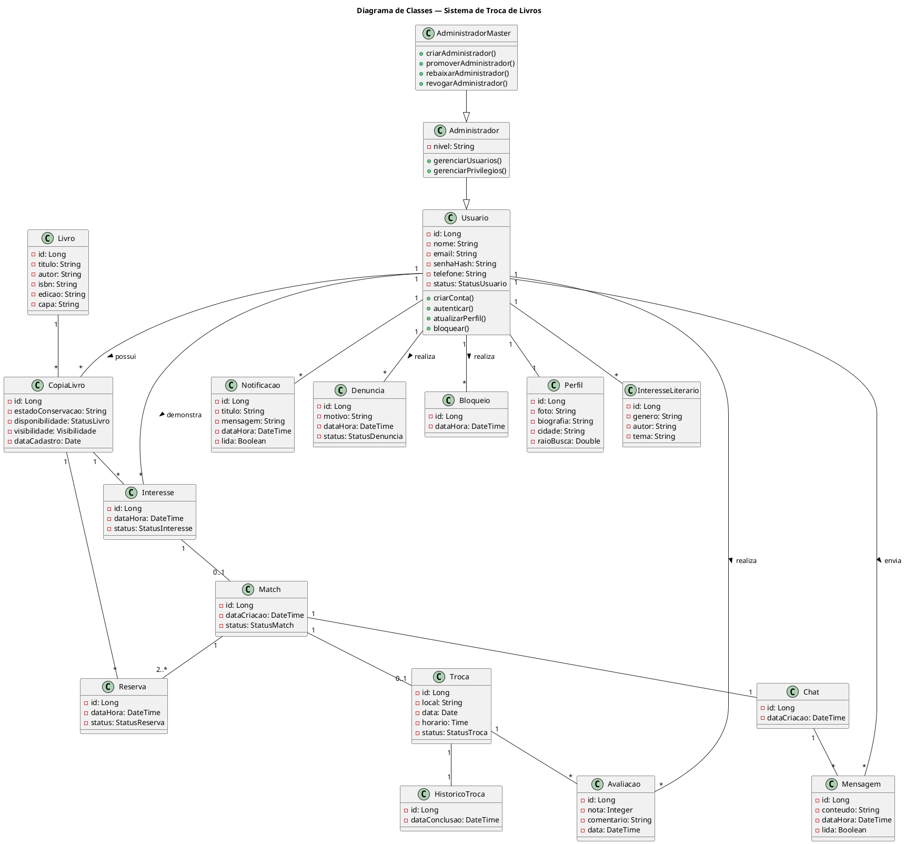

## Código Mermaid

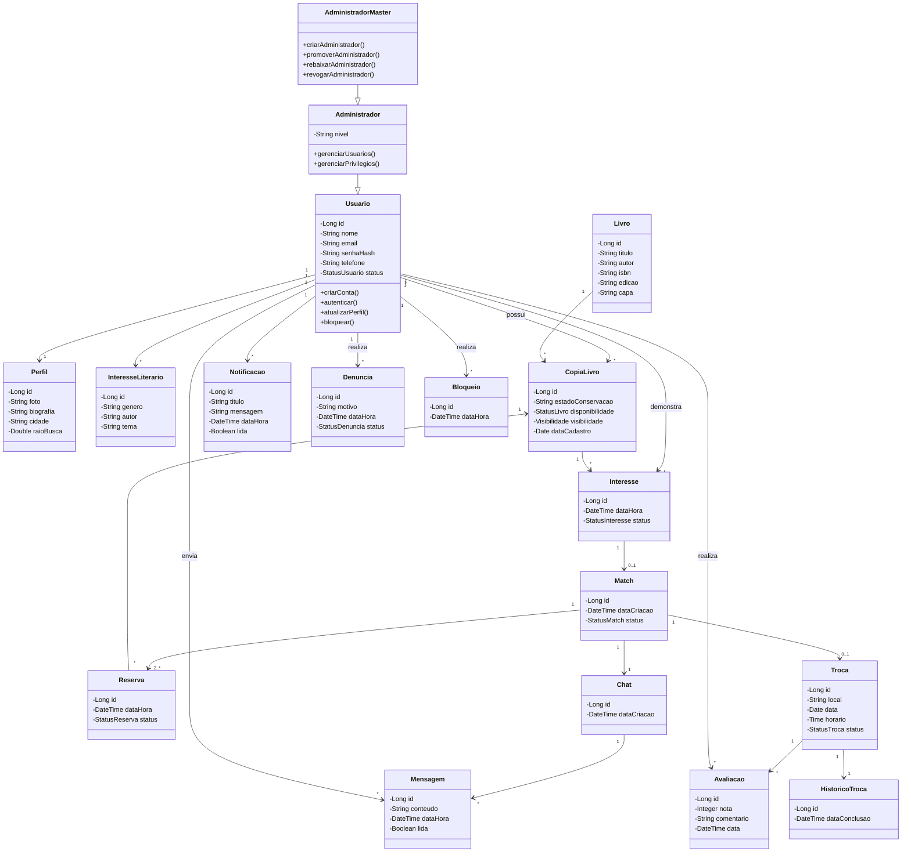

[⬆ Voltar ao índice](#-índice)

---

## 📝 Critério de organização

Os diagramas foram separados de acordo com a finalidade de cada representação UML:

- **Casos de Uso:** mostram as funcionalidades do sistema e os atores que interagem com elas.
- **Diagrama de Sequência:** mostra a ordem das interações entre os participantes durante o fluxo principal.
- **Diagramas de Atividade:** mostram os processos, ações, decisões e caminhos alternativos.
- **Diagrama de Classes:** mostra a estrutura estática do sistema, suas principais entidades e relacionamentos.

### Por que existem dois diagramas de atividade?

Os dois diagramas representam **processos de negócio distintos**:

1. **Cadastro e disponibilização de livro**
2. **Processo de realização da troca**

A separação evita que um único fluxo fique excessivamente extenso e permite representar com maior clareza as decisões específicas de cada processo.

---

## 📌 Observação

Os códigos apresentados neste documento são mantidos junto à documentação para permitir a consulta dos **comandos utilizados na construção dos diagramas**, facilitando a análise, manutenção e evolução da modelagem.

---

## 👨‍💻 Projeto

**Sistema de Troca de Livros**

**Modelagem:** UML / PlantUML / Mermaid  
**Documentação:** Markdown  
**Versionamento:** Git / GitHub
