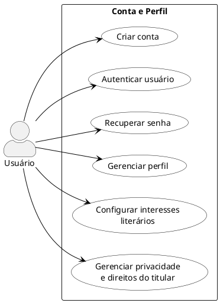
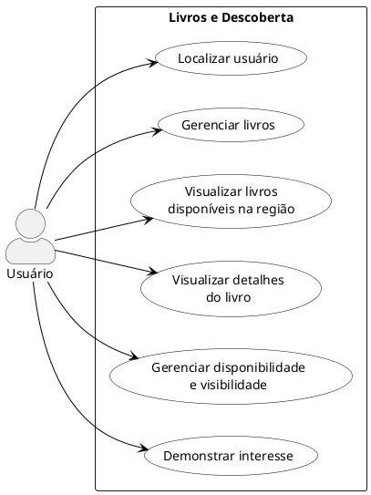
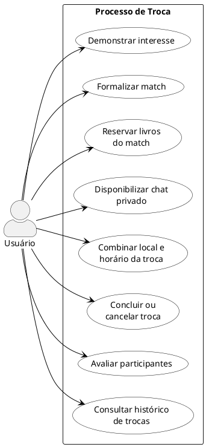
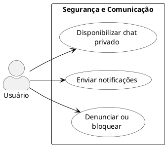
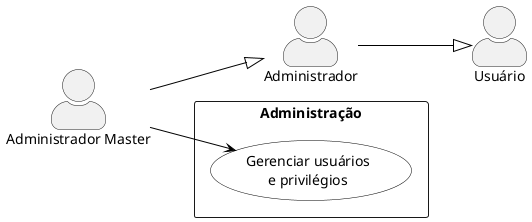
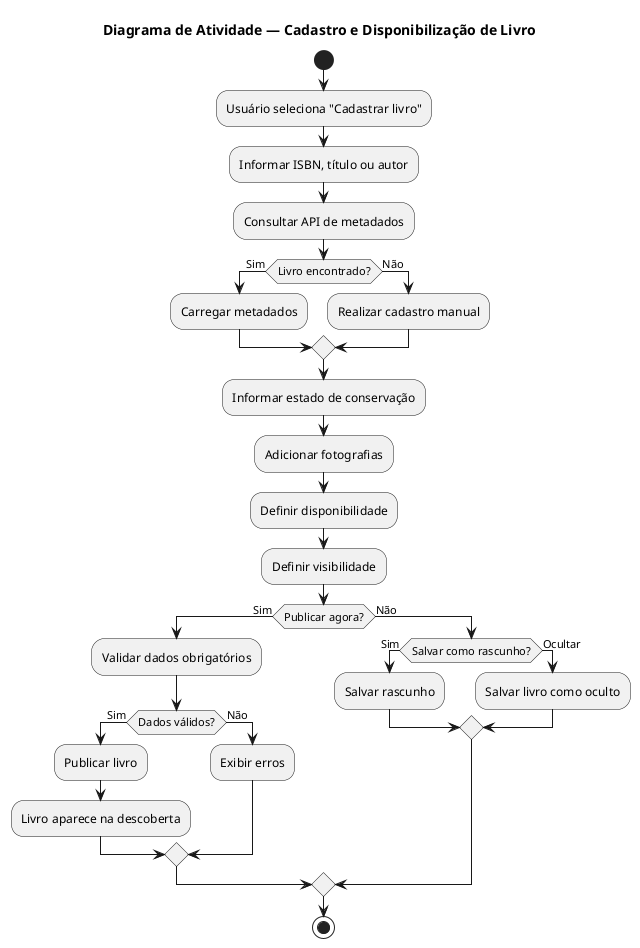
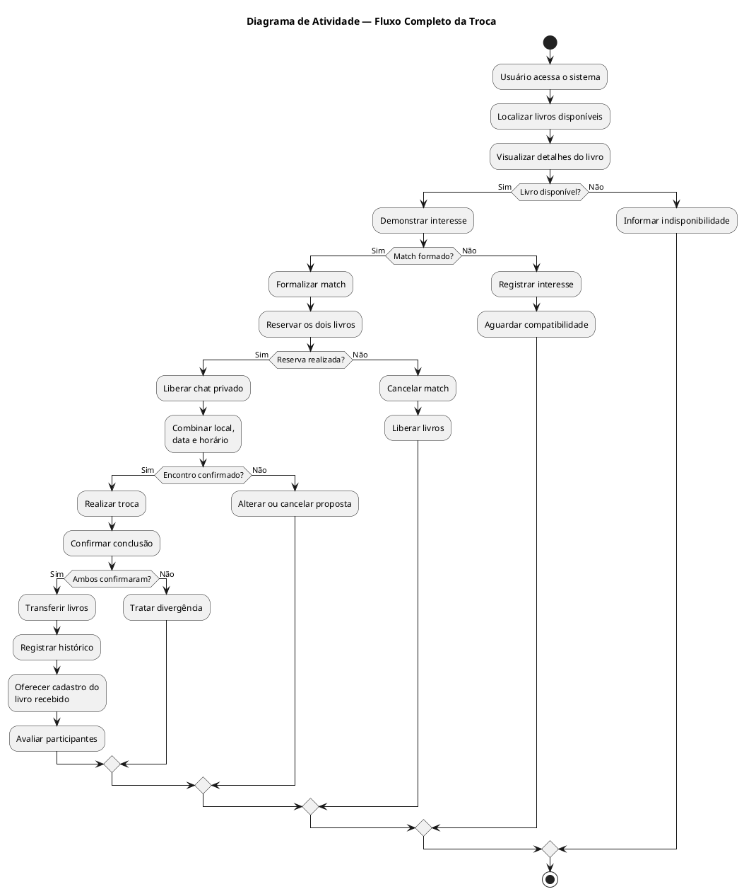
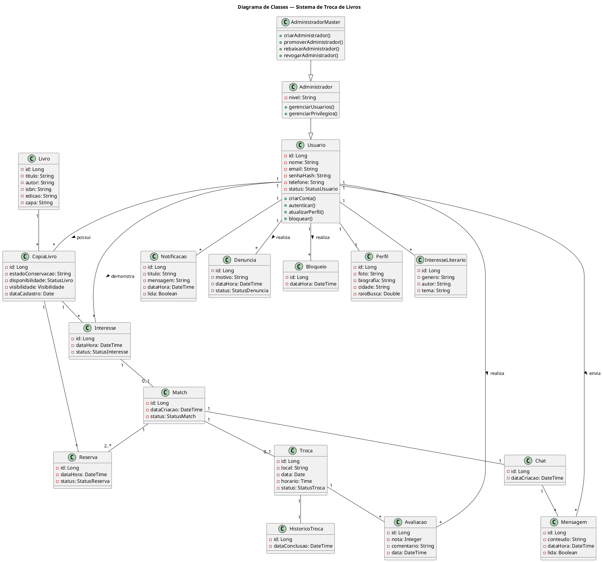

# Diagramas UML — Sistema de Troca de Livros

Este arquivo reúne os códigos **PlantUML** dos diagramas UML desenvolvidos para o Sistema de Troca de Livros.

## Estrutura dos diagramas

### Casos de Uso
1. Visão Geral
2. Conta e Perfil
3. Livros e Descoberta
4. Processo de Troca
5. Segurança e Comunicação
6. Administração

### Sequência
7. Diagrama de Sequência Geral

### Atividades
8. Cadastro e Disponibilização de Livro
9. Processo Completo da Troca

### Classes
10. Modelo Geral do Sistema

---

# 1. Diagramas de Casos de Uso

## 1.1 — Visão Geral

```plantuml
@startuml
left to right direction

skinparam packageStyle rectangle
skinparam actorStyle awesome

actor "Usuário" as Usuario
actor "Administrador" as Admin
actor "Administrador Master" as Master

Admin --|> Usuario
Master --|> Admin

rectangle "Sistema de Troca de Livros" {

    package "Conta e Perfil" {
        usecase "Gerenciar conta\ne perfil" as Conta
    }

    package "Livros e Descoberta" {
        usecase "Gerenciar e descobrir\nlivros" as Livros
    }

    package "Troca" {
        usecase "Realizar troca\nde livros" as Troca
    }

    package "Segurança e Comunicação" {
        usecase "Comunicar e\nproteger usuários" as Seguranca
    }

    package "Administração" {
        usecase "Gerenciar usuários\ne privilégios" as AdminUC
    }
}

Usuario --> Conta
Usuario --> Livros
Usuario --> Troca
Usuario --> Seguranca

Master --> AdminUC

@enduml
```

---

## 1.2 — Conta e Perfil



---

## 1.3 — Livros e Descoberta



---

## 1.4 — Processo de Troca



---

## 1.5 — Segurança e Comunicação



---

## 1.6 — Administração



---

# 2. Diagrama de Sequência

## 2.1 — Sequência Geral do Sistema

Este diagrama representa o fluxo principal do sistema, desde a autenticação e descoberta de livros até a realização da troca, avaliação e consulta do histórico.

```plantuml
@startuml
title Diagrama de Sequência Geral — Sistema de Troca de Livros

actor "Usuário" as Usuario

participant "Aplicativo Web" as App
participant "API / Sistema" as Sistema
participant "Serviço de Autenticação" as Auth
participant "Serviço de Livros" as Livros
participant "Serviço de Match" as Match
participant "Serviço de Troca" as Troca
participant "Serviço de Notificações" as Notif
database "Banco de Dados" as BD

== 1. Cadastro / Autenticação ==

Usuario -> App : Acessa o sistema
App -> Sistema : Solicita autenticação
Sistema -> Auth : Validar credenciais
Auth -> BD : Consultar usuário
BD --> Auth : Dados do usuário
Auth --> Sistema : Autenticação aprovada
Sistema --> App : Sessão iniciada
App --> Usuario : Exibe página inicial

== 2. Descoberta de livros ==

Usuario -> App : Busca livros disponíveis
App -> Sistema : Solicita livros da região
Sistema -> Livros : Buscar livros
Livros -> BD : Consultar livros disponíveis
BD --> Livros : Lista de livros
Livros --> Sistema : Livros encontrados
Sistema --> App : Retorna resultados
App --> Usuario : Exibe livros disponíveis

Usuario -> App : Visualiza detalhes do livro
App -> Sistema : Solicita detalhes
Sistema -> Livros : Consultar livro
Livros -> BD : Buscar informações
BD --> Livros : Dados do livro
Livros --> Sistema : Detalhes
Sistema --> App : Retorna detalhes
App --> Usuario : Exibe detalhes

== 3. Interesse e Match ==

Usuario -> App : Demonstra interesse
App -> Sistema : Registra interesse
Sistema -> Match : Analisar interesse
Match -> BD : Consultar compatibilidade
BD --> Match : Dados dos usuários/livros

alt Match não encontrado

    Match --> Sistema : Interesse registrado
    Sistema -> Notif : Gerar notificação
    Notif --> Usuario : Interesse registrado

else Match encontrado

    Match --> Sistema : Match confirmado

    Sistema -> Troca : Solicitar reserva
    Troca -> BD : Reservar livros

    alt Reserva realizada

        BD --> Troca : Reserva confirmada
        Troca --> Sistema : Match ativo

        Sistema -> Notif : Notificar participantes
        Notif --> Usuario : Match confirmado

    else Falha na reserva

        BD --> Troca : Reserva não realizada
        Troca --> Sistema : Operação cancelada
        Sistema --> App : Informa falha
        App --> Usuario : Reserva não realizada

    end

end

== 4. Chat e negociação ==

Usuario -> App : Abre chat do match
App -> Sistema : Solicita chat
Sistema -> BD : Validar match ativo
BD --> Sistema : Match válido
Sistema --> App : Libera chat

Usuario -> App : Envia mensagem
App -> Sistema : Envia mensagem
Sistema -> BD : Salva mensagem
Sistema -> Notif : Gerar notificação
Notif --> Usuario : Nova mensagem

== 5. Combinação da troca ==

Usuario -> App : Propõe local e horário
App -> Sistema : Envia proposta
Sistema -> Troca : Registrar proposta
Troca -> BD : Salvar local/data/horário
Sistema -> Notif : Notificar participante
Notif --> Usuario : Nova proposta recebida

Usuario -> App : Confirma proposta
App -> Sistema : Confirmar encontro
Sistema -> Troca : Atualizar troca
Troca -> BD : Salvar confirmação

== 6. Conclusão da troca ==

Usuario -> App : Confirma realização da troca
App -> Sistema : Solicita conclusão
Sistema -> Troca : Validar conclusão
Troca -> BD : Registrar conclusão

alt Troca concluída

    BD --> Troca : Operação concluída
    Troca --> Sistema : Troca finalizada

    Sistema -> BD : Registrar histórico
    Sistema -> Notif : Enviar confirmação
    Notif --> Usuario : Troca concluída

else Divergência

    BD --> Troca : Divergência identificada
    Troca --> Sistema : Solicitar tratamento
    Sistema --> App : Exibir divergência
    App --> Usuario : Orientação sobre divergência

end

== 7. Avaliação ==

Usuario -> App : Avalia participante
App -> Sistema : Envia avaliação
Sistema -> BD : Registrar avaliação
BD --> Sistema : Avaliação registrada
Sistema --> App : Confirma avaliação
App --> Usuario : Avaliação concluída

== 8. Histórico ==

Usuario -> App : Consulta histórico
App -> Sistema : Solicita histórico
Sistema -> BD : Buscar trocas concluídas
BD --> Sistema : Histórico
Sistema --> App : Retorna histórico
App --> Usuario : Exibe histórico

@enduml
```



---

# 3. Diagramas de Atividade

Foram utilizados **dois diagramas de atividade** porque representam processos de negócio diferentes: o primeiro trata do ciclo de cadastro/disponibilização do livro e o segundo trata do processo de troca. A separação evita um fluxo excessivamente grande e melhora a legibilidade.

---

## 3.1 — Cadastro e Disponibilização de Livro

Relaciona-se principalmente ao gerenciamento de livros, disponibilidade e visibilidade.



---

## 3.2 — Processo Completo da Troca



---

# 4. Diagrama de Classes

O diagrama de classes apresenta o modelo conceitual das principais entidades envolvidas no sistema e seus relacionamentos.



---

# 5. Organização sugerida dos arquivos

```text
diagramas/
│
├── casos-de-uso/
│   ├── 01-visao-geral.puml
│   ├── 02-conta-perfil.puml
│   ├── 03-livros-descoberta.puml
│   ├── 04-processo-troca.puml
│   ├── 05-seguranca-comunicacao.puml
│   └── 06-administracao.puml
│
├── sequencia/
│   └── 01-sequencia-geral.puml
│
├── atividades/
│   ├── 01-cadastro-livro.puml
│   └── 02-processo-troca.puml
│
└── classes/
    └── 01-modelo-geral.puml
```

## Observação

Os diagramas de casos de uso apresentam a visão funcional do sistema. O diagrama de sequência detalha o fluxo temporal principal da aplicação. Os dois diagramas de atividade representam processos de negócio distintos, e o diagrama de classes apresenta a estrutura conceitual das entidades e seus relacionamentos.
